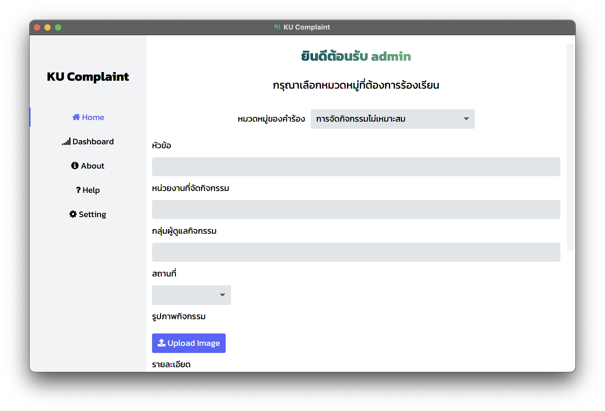

# CS211 - Project (LoveAndJava)
# KU-Complaint
โปรแกรมแจ้งเรื่องร้องเรียนภายในมหาวิทยาลัยเกษตรศาสตร์


## ความก้าวหน้าครั้งที่ 1

- ออกแบบโครงสร้างโปรเจค
- วางแผนว่าตัวโปรแกรมจะมีหน้าอะไรบ้าง
- ออกแบบ view สําหรับตัวโปรแกรม
- ออกแบบ controller ที่ใช้ควบคุมในส่วนของ view
- สร้าง class และคิด field กับ method แต่ยังไม่ implement หลักการใดๆ

## ความก้าวหน้าครั้งที่ 2
- อ่านเขียนข้อมูลในไฟล์ csv ได้
- ทําระบบสมัครสมาชิกของนิสิต/ครู ระบบล็อกอิน
- ทําระบบแจ้งเรื่องร้องเรียน
- แสดงผลเรื่องร้องเรียนทั้งหมด
- ทําหน้าแสดงรายละเอียดเรื่องร้องเรียน
- แสดงผลผู้ใช้ทั้งหมด
- ทําหน้า setting ให้เปลี่ยนธีม/ฟอนต์/ขนาดฟอนด์ เปลี่ยนชื่อ/รหัส ได้

## ความก้าวหน้าครั้งที่ 3
- ทําระบบเพิ่มหมวดหมู่
- ทําระบบเพิ่มหน่วยงาน
- เก็บคําตอบของเรื่องร้องเรียนที่ผู้ใช้กรอกเข้ามา
- แสดงผลรายละเอียดเรื่องร้องเรียน
- ทําระบบ sort เรื่องร้องเรียนโดยเวลาและจํานวนโหวต
- ทําระบบ filter แสดงผลเรื่องร้องเรียนที่สนใจ

## ความก้าวหน้าครั้งที่ 4
- อัพโหลดรูปภาพและแสดงผลได้
- รายงานผู้ใช้ รายงานเรื่องร้องเรียนได้
- ระงับผู้ใช้และคืนสิทธิ์การใช้งานได้
- ตกแต่งตัวโปรแกรมด้วย css เพิ่มเติม
- ทดสอบระบบ

## Installation

1. clone project repository.
   ```
   git clone https://github.com/CS211-651/project211-loveandjava.git
   ```
2. executable file locate in jar folder.
3. or download the zip file in releases.
4. choose your version to run.
5. run the file
   - double-click the jar file to run the program.
   - or run manually by write this command in your terminal or write `java -jar` and drag the file into terminal. Make sure that you are in the same directory as the program locate.
   ```
   java -jar path/to/ku-complaint-<mac or windows>-version.jar
   ```

## Admin account

- username: admin
- password: 1234

## Library used

- FontawesomeFX
- OpenCSV
- AnimateFX

## Project structure

```
src/main
    ├── java
           ├── ku/cs
		├── controllers
		       ├── agency
		             ├── AddAgencyDialogController.java
		             ├── AddCategoryDialogController.java
		             ├── AgencyController.java
		             ├── AssignAgencyDialogController.java
		             ├── RenameAgencyDialogController.java
		       ├── complaintcategory
		             ├── AddAttributeDialogController.java
		             ├── AddCategoryDialogController.java
		             ├── AddChoiceDialogController.java
		             ├── ComplaintCategoryDetail.java
		             ├── RenameAttributeDialogController
		             ├── RenameCategoryDialogController
		             ├── RenameChoiceDialogController
		       ├── setting
		             ├── ChangeNameController.java
		             ├── ChangePasswordController.java
		             ├── ChangeUserNameController.java
		             ├── SettingDetailController.java
		       ├── LoginDetailController.java
		       ├── RegisterDetailController.java
		       ├── MainApplicationDetailController.java
		       ├── HomeDetailController.java
		       ├── SettingDetailController.java
		       ├── DashboardDetailController.java
		       ├── ComplaintDetailController.java
		       ├── ComplaintInfoController.java
		       ├── ConfirmationDialogController.java
		       ├── ManageComplaintController.java
		       ├── ReportController.java
		       ├── ReportDialogController.java
		       ├── RequestUnsuspendDialogController.java
		       ├── ShowUserDetailController.java
		       ├── SuspendDialogController.java
		       ├── TeacherRegisterController.java
		├── models
		       ├── Agency.java
		       ├── AgencyList.java
		       ├── Appearence.java
		       ├── CategoryAttribute.java
		       ├── CategoryAttributeList.java
		       ├── Complaint.java
		       ├── ComplaintCategory.java
		       ├── ComplaintCategoryList.java
		       ├── ComplaintList.java
		       ├── Report.java
		       ├── ReportList.java
		       ├── Role.java
		       ├── SuspendUser.java
		       ├── SuspendUserList.java
		       ├── User.java
		       ├── UserList.java
		├── services
		       ├── collection
		             ├── Filterer
		             ├── Sorter
		             ├── DateComparator
		             ├── VoteComparator
		       ├── DataSource.java
		       ├── AgencyListDataSource.java
		       ├── CategoryAttributeListDataSource.java
		       ├── ComplaintCategoryListDataSource.java
		       ├── ReportListDataSource.java
		       ├── SuspendUserListDataSource.java
		       ├── UserListDataSource.java
                ├── datastructure
                       ├── ListMap.java
                       ├── Pair.java
                       ├── TestListMap
	   ├── module-info.java
     ├── resources/ku/cs
	   ├── view
                 ├── agency
                        ├── addAgencyDialog.fxml
                        ├── addCategoryDialgo.fxml
                        ├── agency.fxml
                        ├── assignAgencyDialog.fxml
                        ├── renameAgencyDialog.fxml
                 ├── complaintCategory
                        ├── addAttributeDialog.fxml
                        ├── addCategoryDialog.fxml
                        ├── addChoiceDialog.fxml
                        ├── complaintCategory.fxml
                        ├── renameAttributeDialog.fxml
                        ├── renameCategoryDialog.fxml
                        ├── renameChoiceDialog.fxml
                 ├── login.fxml
                 ├── register.fxml
                 ├── main-application.fxml
                 ├── home.fxml
                 ├── about.fxml
                 ├── help.fxml
                 ├── setting.fxml
                 ├── dashboard.fxml
                 ├── complaint.fxml
                 ├── complaintDetail.fxml
                 ├── confirmationDialog.fxml
                 ├── manageComplaint.fxml
                 ├── report.fxml
                 ├── requestUnsuspendDialog.fxml
                 ├── showUser.fxml
                 ├── suspendDialog.fxml
                 ├── teacher-register.fxml
                                      
	   ├── css
                 ├── fonts
                        ├── Helvetica.css
                        ├── Kanit.css
                        ├── Sarabun.css            
                 ├── fontSize
                        ├── 12px.css
                        ├── 16px.css
                        ├── 18px.css
                        ├── 20px.css
                        ├── 24px.css
                 ├── themes
                        ├── dark.css
                        ├── light.css
                        ├── snow.css
                 ├── main.css
                 ├── login.css
                 ├── register.css
                 ├── request_suspend_dialog.css
                 ├── dialog.css
	   ├── images
                 ├── arm.jpg
                 ├── ice.jpg
                 ├── non.jpg
                 ├── ong.jpg
                 ├── mountain-bg.jpg
                 ├── ku-logo.jpg
```

## Contributors

<table>
   <tr>
      <td>
         <a href="https://github.com/Qu1etboy">
           
         </a>
         <div>
            Qu1etboy
         </div>
      </td>
      <td>
         <a href="https://github.com/IceSarun">
           
         </a>
         <div>
            IceSarun
         </div>
      </td>
      <td>
         <a href="https://github.com/ong22280">
           
         </a>
         <div>
            ong22280
         </div>
      </td>
      <td>
         <a href="https://github.com/nachpolRN">
           
         </a>
         <div>
            nachpolRN
         </div>
      </td>
   </tr>
</table>

[//]: # (**วิธีทดสอบการ RUN**)

[//]: # (1. Main)

[//]: # (   - `run Main Class`)

[//]: # (2. javafx plugin)

[//]: # (   - `MVN Clean`)

[//]: # (   - `javafx -> javafx:run`)

[//]: # ()
[//]: # (**วิธีสร้าง Jar**<br>)

[//]: # (MVN Clean<br>)

[//]: # (MVN install<br><br>)

[//]: # (file จะอยู่ใน target เป็น shade.jar )


